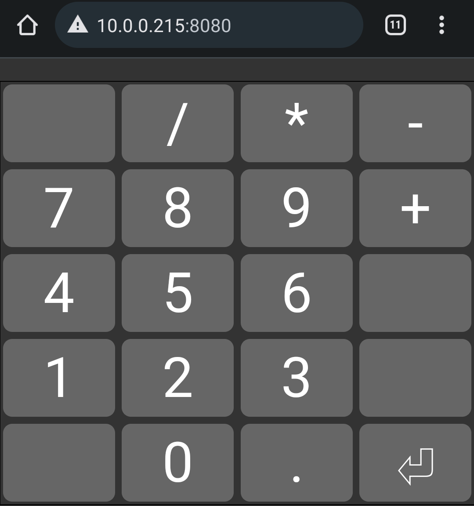

# Offscreen Keyboard

A quick hack to run a numpad on my phone, as my laptop doesn't have one.

Plans are to develop this as I need to, but given the issues below I doubt it'll get much support. Probably explains why this approach isn't very common..

Known Issues:
* Communication is unencrypted (HTTP)
  * There's a session cookie, but the pairing process could be sniffed
  * Just switching on HTTPS for the server isn't easy
  * Don't run this over the internet and you should be fine
* I've only tested this on Windows so far

# Usage

* Download the latest release
* Run the executable
* Scan the QR code on a phone/tablet
* When finished, close the desktop window to shutdown the server

# A Note on Antivirus

This tool takes input from the network, and forwards it to your keyboard. Reasonably some antivirus tools will flag as possible malware.

I've set things up to minimise this as much as I can, and will work on it over time.

For now your options are to run the executable release and ignore things like Smartscreen/Windows defender, or build from source yourself.

# Building

Requirements:
* Python
* npm
* The usual dev environment

Usage:
* `./run-dev.sh` to build and start server
* Navigate to server on your phone/other device
* Press buttons

